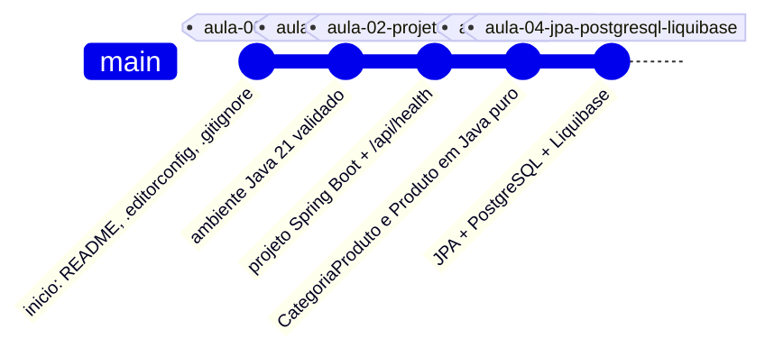

# restaurante2026

API didatica de gestao de pedidos de restaurante, desenvolvida na disciplina de Desenvolvimento de Sistemas do curso de Sistemas de Informacao, seguindo a estrutura pedagogica do repositorio de referencia [`suporteos2026`](https://github.com/jeffersonarpasserini/suporteos2026) (Prof. Jefferson Passerini).

O repositorio esta hoje no ponto de quebra da **Aula 04**: dominio em Java puro, persistencia com Spring Data JPA, PostgreSQL e Liquibase. Nao ha frontend — o curso cobre apenas a API.

## Dominio do projeto

- **Categoria de produto**: classificacao dos itens do cardapio (Entradas, Pratos Principais, Bebidas, Sobremesas).
- **Produto**: item do cardapio, identificado por codigo unico, com saldo em estoque e valor unitario.

Detalhamento completo em [`docs/tema-do-projeto.md`](docs/tema-do-projeto.md).

## Requisitos

- Java 21
- Git
- PostgreSQL 16+ (local ou em container) para os profiles `dev` e `test`
- IntelliJ IDEA (recursos Ultimate para o assistente Spring) ou qualquer editor, usando o Spring Initializr como caminho independente da IDE
- Maven Wrapper (incluido no repositorio, nao requer instalacao manual)

## Estrutura do projeto

```text
restaurante2026/
├── .editorconfig
├── .env.example
├── .gitattributes
├── .gitignore
├── .mvn/wrapper/
├── docs/
│   ├── API.md
│   ├── ARQUITETURA.md
│   └── tema-do-projeto.md
├── mvnw
├── mvnw.cmd
├── pom.xml
└── src/
    ├── main/
    │   ├── java/com/curso/restaurante/
    │   │   ├── Restaurante2026Application.java
    │   │   ├── api/HealthController.java
    │   │   └── domain/
    │   │       ├── CategoriaProduto.java
    │   │       ├── Produto.java
    │   │       └── Status.java
    │   └── resources/
    │       ├── application.properties
    │       ├── application-dev.properties
    │       ├── application-prod.properties
    │       └── db/changelog/
    │           ├── db.changelog-master.yaml
    │           └── changes/
    │               ├── 001-create-categoria-produto.yaml
    │               └── 002-create-produto.yaml
    └── test/
        ├── java/com/curso/restaurante/
        │   ├── Restaurante2026ApplicationTests.java
        │   └── domain/
        │       ├── CategoriaProdutoTest.java
        │       ├── ProdutoTest.java
        │       └── PersistenciaJpaTest.java
        └── resources/application-test.properties
```

Detalhes de responsabilidade de cada camada em [`docs/ARQUITETURA.md`](docs/ARQUITETURA.md).

## Configurando o banco de dados

Na primeira execucao, copie `.env.example` para `.env` e preencha `DB_DEV_PASSWORD`/`DB_TEST_PASSWORD` com a senha do usuario `restaurante_app`. Mantenha `.env` fora do Git (ja coberto pelo `.gitignore`).

Crie o usuario e os bancos no PostgreSQL local (via `psql` ou pgAdmin4):

```sql
CREATE ROLE restaurante_app WITH LOGIN PASSWORD 'defina-uma-senha-local';
CREATE DATABASE restaurante2026_dev OWNER restaurante_app;
CREATE DATABASE restaurante2026_test OWNER restaurante_app;
```

O Liquibase cria as tabelas (`categoria_produto`, `produto`) automaticamente na primeira inicializacao da aplicacao ou dos testes — nao e necessario criar tabelas manualmente. Para conferir pelo pgAdmin4, conecte em `localhost:5432` com o usuario `restaurante_app` e abra o banco `restaurante2026_dev`.

## Executando o projeto

No Windows:

```powershell
.\mvnw.cmd spring-boot:run -Dspring-boot.run.profiles=dev
```

No macOS ou Linux:

```bash
./mvnw spring-boot:run -Dspring-boot.run.profiles=dev
```

Com a aplicacao iniciada, acesse <http://localhost:8080/api/health>. A resposta esperada e `OK`, com status HTTP `200`.

```bash
curl http://localhost:8080/api/health
```

```powershell
Invoke-WebRequest http://localhost:8080/api/health
```

## Executando os testes

Os testes de persistencia acessam `restaurante2026_test` e leem `DB_TEST_PASSWORD` do `.env` local. Ao todo sao 17 testes: 12 de regras de dominio (`CategoriaProdutoTest`, `ProdutoTest`, sem depender de banco), o `contextLoads` da aplicacao e 4 de persistencia (`PersistenciaJpaTest`, contra PostgreSQL real).

Suite completa (Windows):

```powershell
.\mvnw.cmd test
```

Suite completa (macOS ou Linux):

```bash
./mvnw test
```

Apenas as regras de dominio, sem precisar de PostgreSQL rodando:

```powershell
.\mvnw.cmd test "-Dtest=CategoriaProdutoTest,ProdutoTest"
```

Apenas a classe de persistencia (exige `restaurante2026_test` acessivel):

```powershell
.\mvnw.cmd test "-Dtest=PersistenciaJpaTest"
```

Ao final, o resumo esperado e:

```text
Tests run: 17, Failures: 0, Errors: 0, Skipped: 0
BUILD SUCCESS
```

## Comandos uteis

| Objetivo | Comando (Windows) |
|---|---|
| Compilar sem rodar testes | `.\mvnw.cmd compile` |
| Rodar a suite completa | `.\mvnw.cmd test` |
| Empacotar em um JAR executavel | `.\mvnw.cmd package` |
| Empacotar pulando os testes | `.\mvnw.cmd package -DskipTests` |
| Limpar artefatos de build (`target/`) | `.\mvnw.cmd clean` |
| Ver a versao do Maven/Java usada pelo wrapper | `.\mvnw.cmd -v` |

Depois de `package`, o JAR fica em `target/restaurante2026-0.0.1-SNAPSHOT.jar` e pode ser executado sem o Maven:

```powershell
java -jar target\restaurante2026-0.0.1-SNAPSHOT.jar --spring.profiles.active=dev
```

No macOS ou Linux, os mesmos comandos usam `./mvnw` no lugar de `.\mvnw.cmd` e `/` no lugar de `\` nos caminhos.

## Consultando o banco pelo pgAdmin4 ou psql

Com a aplicacao (ou os testes) executada ao menos uma vez, o Liquibase ja criou o esquema. Para conferir:

- **pgAdmin4**: conecte em `localhost:5432`, usuario `restaurante_app`, banco `restaurante2026_dev`, e navegue ate `Schemas > public > Tables`.
- **psql**:

```sql
\c restaurante2026_dev
\dt
SELECT id, nome, status FROM categoria_produto;
SELECT id, codigo, descricao, saldo_estoque, valor_unitario FROM produto;
```

As tabelas comecam vazias — nenhuma massa de dados e inserida automaticamente ate a aula que introduzir os controllers REST.

## Roteiro do curso

O sistema foi construido incrementalmente. Cada aula termina em um estado executavel, registrado por um commit e, apos validacao, por uma tag Git no formato `aula-NN-*`.



| Aula | Tema | Estado neste repositorio |
|---|---|---|
| 00 | GitHub e inicio do projeto | Concluida |
| 01 | Configuracao do ambiente | Concluida (atividade escrita pendente) |
| 02 | Criacao do projeto Spring Boot e definicao do tema | Concluida |
| 03 | Modelagem de dominio com Java puro | Concluida |
| 04 | Persistencia com JPA, PostgreSQL e Liquibase | Concluida (ponto de quebra atual) |

## Documentacao da API

Endpoints disponiveis, roadmap, UML do dominio e resultados de teste em [`docs/API.md`](docs/API.md).

## Arquitetura

Diagramas de contexto, camadas, modelo de dominio e fluxo de persistencia em [`docs/ARQUITETURA.md`](docs/ARQUITETURA.md).

## Publicando no GitHub

O historico Git local ja segue o padrao do curso — um commit e uma tag anotada por aula (`aula-00-inicio` ate `aula-04-jpa-postgresql-liquibase`). Falta apenas ligar o repositorio local a um remoto e publicar:

```powershell
git remote add origin https://github.com/SEU-USUARIO/restaurante2026.git
git push -u origin main
git push origin --tags
```

Antes do push, confirme que nenhuma credencial foi commitada:

```powershell
git grep -n -E "DB_(DEV_|TEST_)?PASSWORD=.+" -- ":!*.example"
```

Esse comando nao deve encontrar nada — `.env` real nunca foi adicionado a nenhum commit, apenas `.env.example` (com placeholders).
