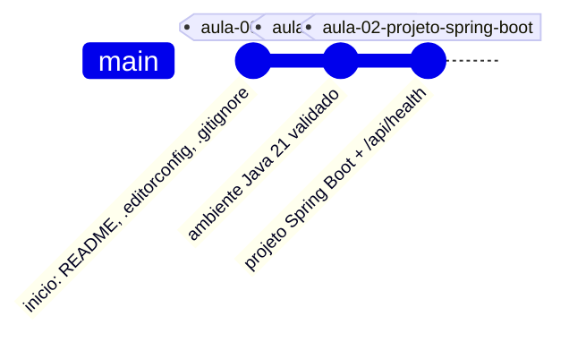

# restaurante2026

API didatica de gestao de pedidos de restaurante, desenvolvida na disciplina de Desenvolvimento de Sistemas do curso de Sistemas de Informacao, seguindo a estrutura pedagogica do repositorio de referencia [`suporteos2026`](https://github.com/jeffersonarpasserini/suporteos2026) (Prof. Jefferson Passerini).

O repositorio esta hoje no ponto de quebra da **Aula 02**: projeto Spring Boot minimo, com o endpoint `GET /api/health`.

## Dominio do projeto

- **Categoria de produto**: classificacao dos itens do cardapio (Entradas, Pratos Principais, Bebidas, Sobremesas).
- **Produto**: item do cardapio, identificado por codigo unico, com saldo em estoque e valor unitario.

Detalhamento completo em [`docs/tema-do-projeto.md`](docs/tema-do-projeto.md).

## Requisitos

- Java 21
- Git
- IntelliJ IDEA (recursos Ultimate para o assistente Spring) ou qualquer editor, usando o Spring Initializr como caminho independente da IDE
- Maven Wrapper (incluido no repositorio, nao requer instalacao manual)

## Estrutura do projeto

```text
restaurante2026/
├── .editorconfig
├── .gitattributes
├── .gitignore
├── .mvn/wrapper/
├── docs/
│   └── tema-do-projeto.md
├── mvnw
├── mvnw.cmd
├── pom.xml
└── src/
    ├── main/
    │   ├── java/com/curso/restaurante/
    │   │   ├── Restaurante2026Application.java
    │   │   └── api/HealthController.java
    │   └── resources/application.properties
    └── test/
        └── java/com/curso/restaurante/
            └── Restaurante2026ApplicationTests.java
```

Os pacotes `domain`, `repository` e `service` serao criados abaixo de `com.curso.restaurante` a partir da Aula 03, conforme cada camada for necessaria.

## Executando o projeto

No Windows:

```powershell
.\mvnw.cmd spring-boot:run
```

No macOS ou Linux:

```bash
./mvnw spring-boot:run
```

Com a aplicacao iniciada, acesse <http://localhost:8080/api/health>. A resposta esperada e `OK`, com status HTTP `200`.

```bash
curl http://localhost:8080/api/health
```

```powershell
Invoke-WebRequest http://localhost:8080/api/health
```

## Executando os testes

No Windows:

```powershell
.\mvnw.cmd test
```

No macOS ou Linux:

```bash
./mvnw test
```

## Roteiro do curso

O sistema sera construido incrementalmente. Cada aula termina em um estado executavel, registrado por um commit e, apos validacao, por uma tag Git no formato `aula-NN-*`.



| Aula | Tema | Estado neste repositorio |
|---|---|---|
| 00 | GitHub e inicio do projeto | Concluida |
| 01 | Configuracao do ambiente | Concluida |
| 02 | Criacao do projeto Spring Boot e definicao do tema | Concluida (ponto de quebra atual) |
| 03 | Modelagem de dominio com Java puro | Nao iniciada |
| 04 | Persistencia com JPA, PostgreSQL e Liquibase | Nao iniciada |
