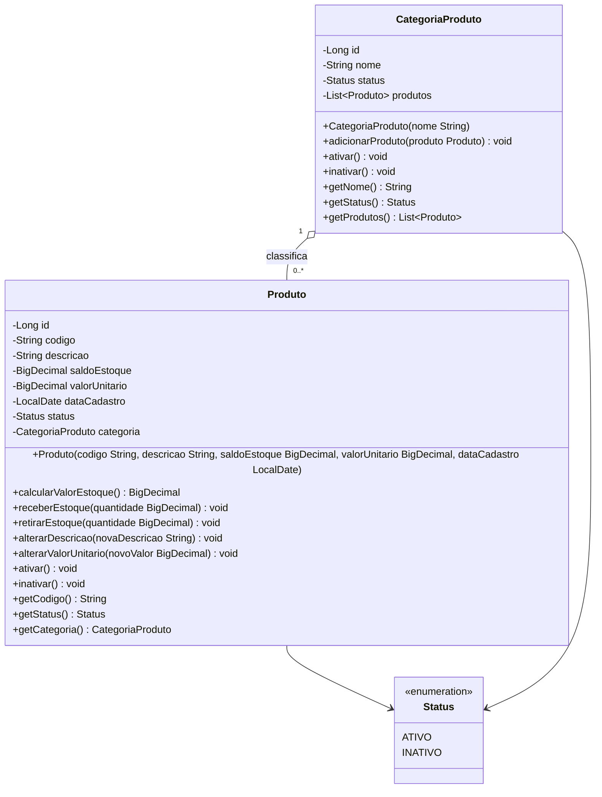
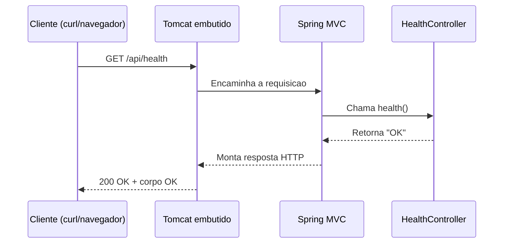

# Documentacao da API

Referencia completa dos endpoints, do modelo de dominio e da evidencia de testes do `restaurante2026`, no ponto de quebra da Aula 04.

- **Base URL local**: `http://localhost:8080`
- **Formato**: texto puro no unico endpoint atual; a API ainda nao expoe JSON porque nenhum controller de dominio foi criado (ver [Roadmap de endpoints](#roadmap-de-endpoints))
- **Autenticacao**: nenhuma (fora do escopo das Aulas 00-04)

## Sumario

- [Endpoints disponiveis](#endpoints-disponiveis)
- [Roadmap de endpoints](#roadmap-de-endpoints)
- [Modelo de dominio (UML)](#modelo-de-dominio-uml)
- [Fluxo de uma requisicao](#fluxo-de-uma-requisicao)
- [Resultados de teste](#resultados-de-teste)
- [Como testar manualmente](#como-testar-manualmente)

## Endpoints disponiveis

### `GET /api/health`

Verifica se a aplicacao esta no ar. Nao consulta o banco de dados — confirma apenas que o processo Spring Boot esta respondendo requisicoes HTTP.

| Item | Valor |
|---|---|
| Metodo | `GET` |
| Caminho | `/api/health` |
| Autenticacao | Nenhuma |
| Parametros | Nenhum |
| Corpo da requisicao | Nenhum |

**Resposta de sucesso**

| Status | Content-Type | Corpo |
|---|---|---|
| `200 OK` | `text/plain` | `OK` |

**Exemplo — curl**

```bash
curl -i http://localhost:8080/api/health
```

```text
HTTP/1.1 200
Content-Type: text/plain;charset=UTF-8

OK
```

**Exemplo — PowerShell**

```powershell
Invoke-WebRequest http://localhost:8080/api/health
```

**Implementacao** (`com.curso.restaurante.api.HealthController`):

```java
@RestController
public class HealthController {

    @GetMapping("/api/health")
    public String health() {
        return "OK";
    }
}
```

## Roadmap de endpoints

Os endpoints abaixo **ainda nao existem** no codigo. `CategoriaProduto` e `Produto` foram modelados (Aula 03) e persistidos (Aula 04), mas nenhuma aula publicada no repositorio de referencia ate agora cria controllers REST para eles — por isso nao ha `CategoriaProdutoController`/`ProdutoController` neste projeto. A tabela serve como planejamento, nao como contrato implementado:

| Metodo | Caminho planejado | Descricao |
|---|---|---|
| `GET` | `/api/categorias` | Listar categorias de produto |
| `POST` | `/api/categorias` | Cadastrar categoria |
| `GET` | `/api/produtos` | Listar produtos |
| `POST` | `/api/produtos` | Cadastrar produto |
| `PATCH` | `/api/produtos/{id}/estoque` | Registrar entrada/saida de estoque |

## Modelo de dominio (UML)



Regras de negocio garantidas pelo proprio objeto Java (nao dependem de validacao externa):

- `Produto` nao existe em estado invalido: codigo, descricao, saldo e valor unitario sao verificados no construtor.
- `retirarEstoque` rejeita quantidade maior que o saldo atual (`IllegalArgumentException`).
- `CategoriaProduto.adicionarProduto` rejeita codigo duplicado dentro da mesma categoria e impede que um produto migre de categoria depois de associado (`IllegalStateException`).

As mesmas regras de unicidade e nao negatividade tambem sao reforcadas no banco (`UNIQUE`, `CHECK`), documentado em [`ARQUITETURA.md`](ARQUITETURA.md#4-persistencia).

## Fluxo de uma requisicao



## Resultados de teste

Execucao mais recente de `.\mvnw.cmd test`, com PostgreSQL local ativo e `.env` preenchido:

```text
Running com.curso.restaurante.domain.CategoriaProdutoTest
Tests run: 5, Failures: 0, Errors: 0, Skipped: 0

Running com.curso.restaurante.domain.PersistenciaJpaTest
Tests run: 4, Failures: 0, Errors: 0, Skipped: 0

Running com.curso.restaurante.domain.ProdutoTest
Tests run: 7, Failures: 0, Errors: 0, Skipped: 0

Running com.curso.restaurante.Restaurante2026ApplicationTests
Tests run: 1, Failures: 0, Errors: 0, Skipped: 0

Tests run: 17, Failures: 0, Errors: 0, Skipped: 0
BUILD SUCCESS
```

| Classe | O que valida | Precisa de PostgreSQL? |
|---|---|---|
| `CategoriaProdutoTest` | Associacao categoria-produto, codigo duplicado, imutabilidade da lista exposta | Nao |
| `ProdutoTest` | Calculo de valor em estoque, entrada/saida de estoque, validacao de construtor, troca de status | Nao |
| `Restaurante2026ApplicationTests` | O contexto Spring sobe com o profile `test` | Sim |
| `PersistenciaJpaTest` | Liquibase aplica os 8 changesets, JPA grava e le `CategoriaProduto`/`Produto`, o banco rejeita codigo duplicado e saldo negativo mesmo via SQL direto | Sim |

Reproduzir localmente:

```powershell
.\mvnw.cmd test
```

## Como testar manualmente

1. Suba a aplicacao com o profile `dev` (ver [`README.md`](../README.md#executando-o-projeto)).
2. Confirme o health check:

   ```powershell
   Invoke-WebRequest http://localhost:8080/api/health
   ```

3. Inspecione o esquema criado pelo Liquibase direto no banco (`categoria_produto`, `produto` ainda vazias, pois nao ha endpoint de cadastro):

   ```sql
   \c restaurante2026_dev
   \dt
   ```

Para exercitar `CategoriaProduto`/`Produto` sem um endpoint REST, use os testes de dominio como referencia executavel de comportamento esperado (`CategoriaProdutoTest`, `ProdutoTest`).
