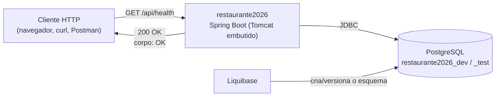
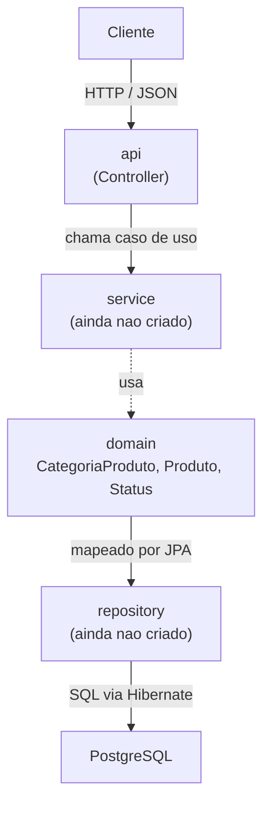
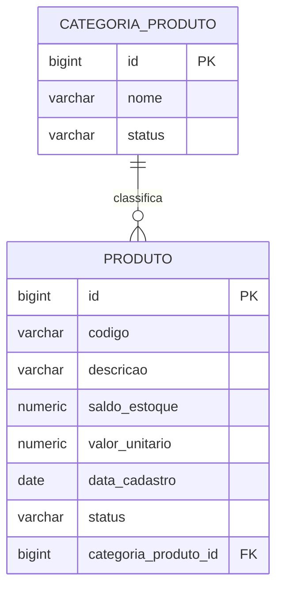
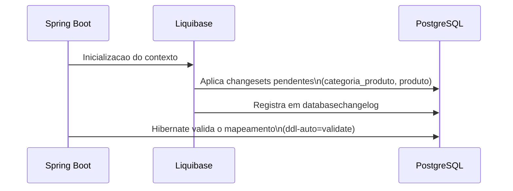
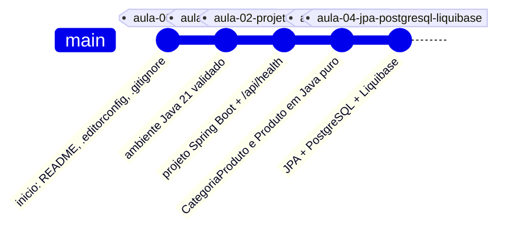

# Arquitetura

Este documento descreve a arquitetura do projeto no ponto de quebra da Aula 04: API Spring Boot com dominio em Java puro, persistencia via Spring Data JPA e esquema versionado pelo Liquibase em PostgreSQL.

Para o contrato dos endpoints HTTP, o diagrama UML das classes de dominio e os resultados de teste, veja [`API.md`](API.md).

## 1. Visao geral



Nao existe frontend neste repositorio: o curso `suporteos2026` cobre apenas a API.

## 2. Camadas e pacotes



```text
com.curso.restaurante
├── api
│   └── HealthController       -> GET /api/health
└── domain
    ├── CategoriaProduto       -> entidade JPA, classifica produtos
    ├── Produto                -> entidade JPA, item do cardapio
    └── Status                 -> enum ATIVO / INATIVO
```

| Camada | Responsabilidade | Estado |
|---|---|---|
| `api` | Receber requisicoes HTTP e construir a resposta | Implementada (somente health check) |
| `domain` | Representar `CategoriaProduto` e `Produto`, aplicar regras de negocio | Implementada (Aula 03) |
| `repository` | Acessar a persistencia via Spring Data JPA | Nao criada — nenhum caso de uso de consulta/CRUD exposto ainda |
| `service` | Coordenar casos de uso entre `api`, `domain` e `repository` | Nao criada |

`repository` e `service` so existem quando houver um caso de uso concreto que os exija; ate a Aula 04 a persistencia e exercitada diretamente por testes com `EntityManager` e `JdbcTemplate`.

## 3. Modelo de dominio



Regras aplicadas em `Produto`:

- `calcularValorEstoque()` = `saldoEstoque * valorUnitario`, arredondado para 2 casas decimais.
- `receberEstoque(quantidade)` / `retirarEstoque(quantidade)` rejeitam quantidades zero ou negativas; `retirarEstoque` tambem rejeita saldo insuficiente.
- Codigo, descricao, saldo e valor unitario sao validados na criacao do objeto — nao existe estado invalido representavel em Java.

Regras aplicadas em `CategoriaProduto`:

- `adicionarProduto(produto)` mantem os dois lados da associacao consistentes e rejeita codigo duplicado dentro da mesma categoria.
- Um `Produto` nao pode ser movido para outra `CategoriaProduto` depois de associado (`IllegalStateException`).

O banco reforca as mesmas regras de forma independente da aplicacao: `CHECK` constraints para saldo/valor nao negativos e status valido, e `UNIQUE` para o codigo do produto — ver `PersistenciaJpaTest`.

## 4. Persistencia



- **Liquibase** e a unica fonte de verdade do esquema. O `master` inclui, em ordem, `001-create-categoria-produto.yaml` e `002-create-produto.yaml` (8 changesets no total).
- **Hibernate** roda em modo `validate`: confere se as entidades Java batem com o esquema, mas nunca gera DDL.
- **Profiles**: `dev` (`restaurante2026_dev`) e `test` (`restaurante2026_test`) leem usuario/senha de um `.env` local (fora do Git); `prod` le variaveis de ambiente do servidor.

## 5. Decisoes tecnicas

| Decisao | Motivo |
|---|---|
| Spring Boot 4.0.7, Java 21 | Versao congelada pelo curso para a turma de 2026 |
| Dominio em Java puro validando suas proprias invariantes | As regras de negocio nao dependem do framework de persistencia para existir |
| Liquibase versiona, Hibernate so valida | Evita duas fontes de verdade para o esquema do banco |
| PostgreSQL nos tres profiles, sem H2 | O comportamento em teste precisa refletir o banco usado em producao |
| Sem `repository`/`service` ainda | Camadas so sao criadas quando ha um caso de uso real que as exija |
| Sem frontend | Fora do escopo do curso `suporteos2026`, que cobre apenas a API |

## 6. Roteiro do curso



| Aula | Tema | Estado neste repositorio |
|---|---|---|
| 00 | GitHub e inicio do projeto | Concluida |
| 01 | Configuracao do ambiente | Concluida |
| 02 | Criacao do projeto Spring Boot e definicao do tema | Concluida |
| 03 | Modelagem de dominio com Java puro | Concluida |
| 04 | Persistencia com JPA, PostgreSQL e Liquibase | Concluida (ponto de quebra atual) |
