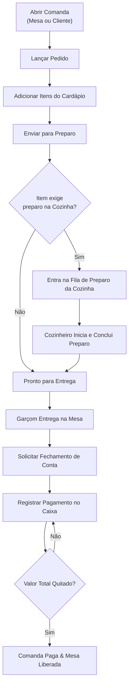

# Tema do Projeto Individual — Gestão de Restaurante

Documentação de especificação do tema individual desenvolvido na disciplina de Programação da graduação em Sistemas de Informação da **UniFEF**, sob orientação do Prof. Jefferson Passerini.

---

## 1. Identificação do Projeto

- **Nome da Aplicação**: `restaurante2026`
- **Domínio**: Gestão Integrada de Restaurantes (Cardápio, Mesas, Comandas, Pedidos, Cozinha e Caixa)
- **Objetivo**: Automatizar de ponta a ponta o atendimento gastronômico: cadastro de cardápio, gestão de ocupação de salão, lançamento de pedidos, enfileiramento de pratos na cozinha, entrega na mesa, fechamento de comandas e conferência financeira de turno de caixa.

---

## 2. Módulos do Domínio

| Módulo | Entidades Principais | Responsabilidade no Sistema |
| :--- | :--- | :--- |
| **Usuários** | `Usuario` | Autenticação, encriptação BCrypt e controle de acesso por papéis (`ADMIN`, `GARCOM`, `COZINHA`, `CAIXA`). |
| **Cardápio** | `CategoriaCardapio`, `ItemCardapio` | Cadastro de produtos vendáveis, seções (Cozinha/Bar), preço unitário e controle de estoque. |
| **Clientes** | `Cliente` | Cadastro de clientes e histórico de consumo. |
| **Mesas** | `Mesa` | Controle do salão com máquina de estados própria (*LIVRE*, *OCUPADA*, *RESERVADA*). |
| **Comandas** | `Comanda` | Agrupamento do consumo por mesa ou cliente, controle de conta e saldo devedor. |
| **Pedidos** | `Pedido`, `ItemPedido` | Gestão de itens solicitados com máquina de estados completa. |
| **Cozinha** | `PreparoItem` | Fila de preparo priorizada em tempo real para os cozinheiros. |
| **Caixa** | `SessaoCaixa`, `Sangria`, `Pagamento` | Turnos de caixa, suprimentos, sangrias e liquidação de contas. |

---

## 3. Rastreabilidade com a Rubrica de Avaliação das Aulas 03 e 04

A disciplina exige que o modelo de domínio atenda a critérios rígidos de modelagem de orientação a objetos e persistência. O redesenho do cardápio (`ItemCardapio`) satisfaz integralmente a rubrica pedagógica:

| Requisito Avaliado nas Aulas 03/04 | Implementação em `ItemCardapio` |
| :--- | :--- |
| **Entidade de Classificação (1:N)** | `CategoriaCardapio` associada a `ItemCardapio` |
| **Identificador / Código Único** | Atributo `codigo` com restrição `uk_item_cardapio_codigo` |
| **Medida Quantitativa** | `saldoEstoque` (com flag `controlaEstoque`) |
| **Valor Monetário** | `precoVenda` utilizando `BigDecimal` |
| **Método com Valor Calculado** | Método `calcularValorEmEstoque()` |
| **Data Relevante** | `dataCadastro` armazenada como `Instant` / `LocalDateTime` |
| **Estado do Objeto** | Enum `StatusItemCardapio` (`ATIVO` / `INATIVO`) |

---

## 4. Fluxo Operacional de Atendimento

O diagrama abaixo ilustra o ciclo de vida completo de um atendimento no restaurante:

---

## 5. Qualidade de Software e Testes

O projeto foi construído sob rigorosos critérios de Engenharia de Software:
- **Design de Entidades Ricas**: Validações e invariantes garantidos dentro dos construtores (sem setters expostos indiscriminadamente).
- **Sem Ponto Flutuante**: Uso exclusivo de `BigDecimal` para moedas.
- **354 Testes Automatizados**: Suíte completa integrando testes unitários, testes de persistência com PostgreSQL real e testes de endpoints HTTP (`MockMvc`).
